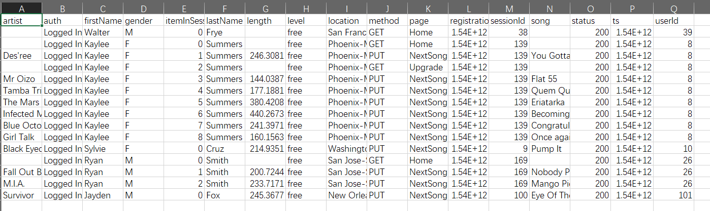

# Project: Data Modeling with Cassandra
A startup called Sparkify wants to analyze the data they've been collecting on songs and user activity on their new music streaming app. The analysis team is particularly interested in understanding what songs users are listening to. Currently, there is no easy way to query the data to generate the results, since the data reside in a directory of CSV files on user activity on the app.

They'd like a data engineer to create an Apache Cassandra database which can create queries on song play data to answer the questions, and wish to bring you on the project. Your role is to create a database for this analysis. You'll be able to test your database by running queries given to you by the analytics team from Sparkify to create the results.

# Project Objective
1. Create tables in Apache Cassandra to model the data in order to run the queries
2. Finish the ETL pipeline that transfers data from a set of CSV files within a directory to create a streamlined CSV file to model and insert data into Apache Cassandra tables

# Data File Walkthrough
For this project, there's only one dataset: event_data. The directory of CSV files partitioned by date. Here are examples of filepaths to two files in the dataset:
```
event_data/2018-11-08-events.csv
event_data/2018-11-09-events.csv
```

## Screenshot of the dataset


There are 30 datasets so we need to merge them into one file first by running the pre-processing part in the notebook
After merging, the new file looks like:


## How to process the data:
1. process the event_datafile_new.csv dataset to create a denormalized dataset
2. model the data tables keeping in mind the queries I need to run
3. queries have been provided to model the data table for
4. load the data into tables I create in Apache Cassandra and run my queries


# How to run the project
```bash
python create_tables.py
python etl.py
```
